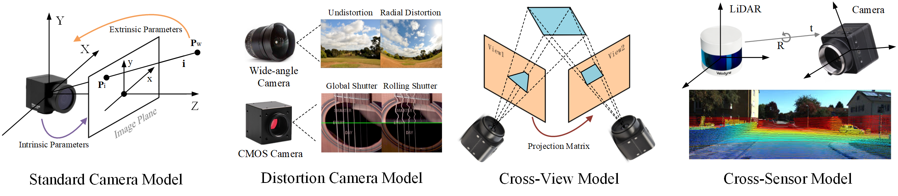
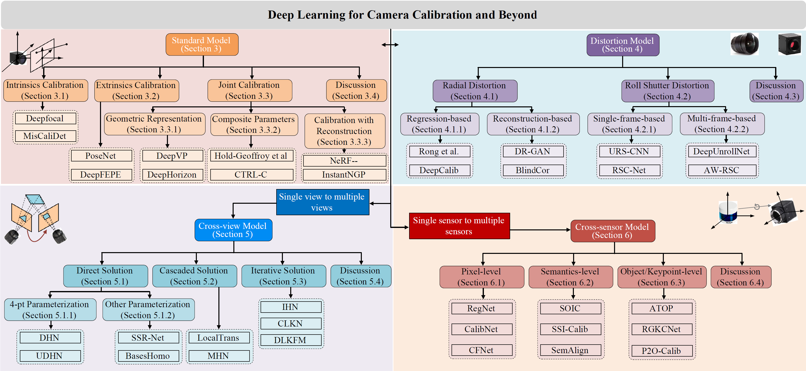
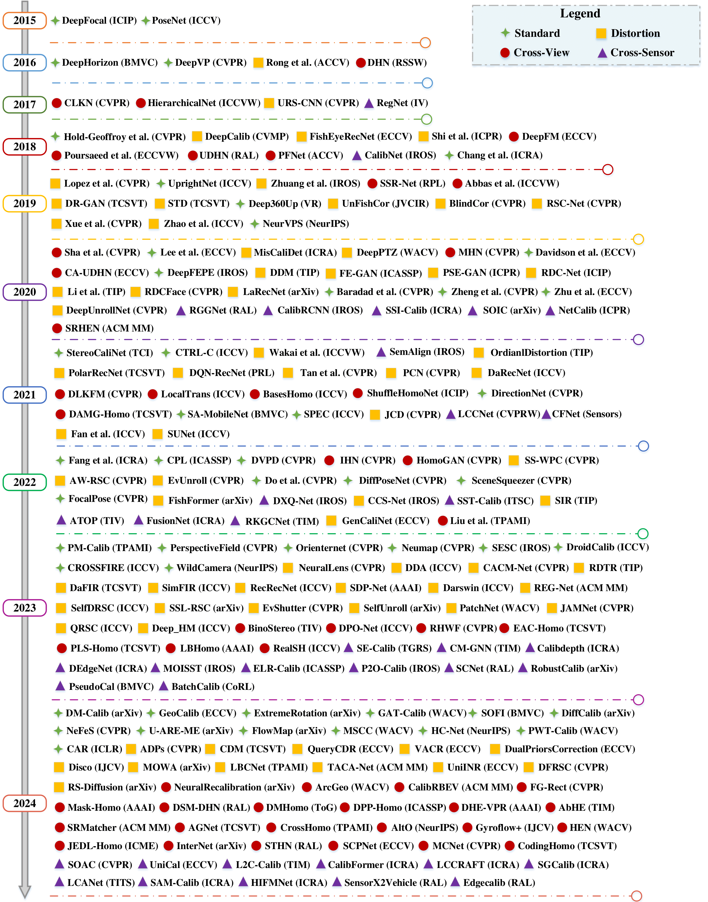

# Awesome-Deep-Camera-Calibration
[](https://arxiv.org/pdf/2303.10559.pdf)
[](https://github.com/sindresorhus/awesome) 
[](https://GitHub.com/Naereen/StrapDown.js/graphs/commit-activity) 
[](http://makeapullrequest.com) 
[](https://github.com/Naereen/StrapDown.js/blob/master/LICENSE)
<!-- [](http://commonmark.org) -->
<!-- [](http://ansicolortags.readthedocs.io/?badge=latest) -->


**<div align="center">Popular calibration objectives, models, and extended applications in camera calibration</div>**

Our repository provides：

 **1)** a time line of the development in the related research community
 **2)** a taxonomy of the survey
 **3)** a public and holistic benchmark 
 **4)** collects deep learning-based camera calibration **Publication, Objective, Network**
 **5)** dataset summary

More content and details can be found in our Survey Paper: [Deep Learning for Camera Calibration and Beyond: A Survey](https://arxiv.org/pdf/2303.10559.pdf). 


## 📣News
* 2024.01.05: The benchmark is released. Please refer to the dataset link and more details in [Benchmark](https://github.com/KangLiao929/Awesome-Deep-Camera-Calibration/blob/main/Benchmark/readme.md).
* 2023.03.19: The survey of the arXiv version is online.

## 📝 Changelog/News

- [x] 2023.03.19: The survey of the arXiv version is online.
- [x] 2024.01.05: The benchmark is released. Please refer to the dataset link and more details in [Benchmark](https://github.com/KangLiao929/Awesome-Deep-Camera-Calibration/blob/main/Benchmark/readme.md).
- [ ] Update the survey paper with bechmark evaluations
- [ ] Update the survey paper with more technical discussions with NeRF
- [ ] Update the literature reviews for 2023 and 2024

## 🚩Contents 
1. [Basics](#Basics)
2. [Taxonomy](#Taxonomy)
3. [Benchmark](#Benchmark)
4. [Methods](#Methods)
5. [Dataset](#Dataset)
6. [Citation](#Citation)
7. [知乎导读](#知乎导读)

## 🚩Basics
* [Multiple view geometry in computer vision](https://cseweb.ucsd.edu/classes/sp13/cse252B-a/HZ2eCh2.pdf) - Hartley, R., & Zisserman, A. (2004)
* [A Flexible New Technique for Camera Calibration](https://www.microsoft.com/en-us/research/wp-content/uploads/2016/02/tr98-71.pdf) - Zhengyou Zhang. (2000)

## 🚩Taxonomy

**<div align="center">The structural and hierarchical taxonomy of camera calibration with deep learning. Some classical methods are listed under each category.</div>**


**<div align="center">A concise milestone of deep learning-based camera calibration methods.</div>** 
We classify all methods based on the uncalibrated camera model and its extended applications: standard model, distortion model, cross-view model, and cross-sensor model.

## 🚩Benchmark

**<div align="center">Overview of our collected benchmark, which covers all models reviewed in this survey.</div>** 
In this dataset, the image and video were derived from diverse cameras under different environments. The accurate ground truth and label are provided for each data. Please refer to the dataset link and more details in [Benchmark](https://github.com/KangLiao929/Awesome-Deep-Camera-Calibration/blob/main/Benchmark/readme.md).

## 🚩Methods

|Year|Publication|Title|Abbreviation|Objective|Platform|Network|
|---|---|---|---|---|---|---|
|2015|[ICIP](https://ieeexplore.ieee.org/abstract/document/7351024)|Deepfocal: A method for direct focal length estimation|DeepFocal|Intrinsics|Caffe|AlexNet|
|2015|[ICCV](https://openaccess.thecvf.com/content_iccv_2015/html/Kendall_PoseNet_A_Convolutional_ICCV_2015_paper.html)|Posenet: A convolutional network for real-time 6-dof camera relocalization|PoseNet|Extrinsics|Caffe|GoogLeNet|
|2016|[BMVC](https://arxiv.org/abs/1604.02129)|Horizon lines in the wild|DeepHorizon|Extrinsics|Caffe|GoogLeNet|
|2016|[CVPR](https://openaccess.thecvf.com/content_cvpr_2016/html/Zhai_Detecting_Vanishing_Points_CVPR_2016_paper.html)|Detecting vanishing points using global image context in a non-manhattan world|DeepVP|Extrinsics|Caffe|AlexNet|
|2016|[ACCV](https://link.springer.com/chapter/10.1007/978-3-319-54187-7_3)|Radial lens distortion correction using convolutional neural networks trained with synthesized images|Rong et al.|Distortion coefficients|Caffe|AlexNet|
|2016|[RSSW](https://arxiv.org/abs/1606.03798)|Deep image homography estimation|DHN|Projection matrixs|Caffe|VGG|
|2017|[CVPR](https://openaccess.thecvf.com/content_cvpr_2017/html/Chang_CLKN_Cascaded_Lucas-Kanade_CVPR_2017_paper.html)|Clkn: Cascaded lucas-kanade networks for image alignment|CLKN|Projection matrixs|Torch|CNN + Lucas-Kanade layer|
|2017|[ICCVW](https://openaccess.thecvf.com/content_ICCV_2017_workshops/w17/html/Nowruzi_Homography_Estimation_From_ICCV_2017_paper.html)|Homography estimation from image pairs with hierarchical convolutional networks|HierarchicalNet|Projection matrixs|TensorFlow|VGG|
|2017|[CVPR](https://openaccess.thecvf.com/content_cvpr_2017/papers/Rengarajan_Unrolling_the_Shutter_CVPR_2017_paper.pdf)|Unrolling the Shutter: CNN to Correct Motion Distortions|URS-CNN|Undistortion|Torch|CNNs|
|2017|[IV](https://arxiv.org/pdf/1707.03167.pdf)|RegNet: Multimodal sensor registration using deep neural networks|RegNet|Camera + LiDAR|Caffe|CNNs|
|2018|[CVPR](https://openaccess.thecvf.com/content_cvpr_2018/html/Hold-Geoffroy_A_Perceptual_Measure_CVPR_2018_paper.html)|A perceptual measure for deep single image camera calibration|Hold-Geoffroy et al.|Intrinsics + Extrinsics| |DenseNet|
|2018|[CVMP](https://dl.acm.org/doi/abs/10.1145/3278471.3278479)|DeepCalib: a deep learning approach for automatic intrinsic calibration of wide field-of-view cameras|DeepCalib|Intrinsics + Distortion coefficients|TensorFlow|Inception-V3|
|2018|[ECCV](https://openaccess.thecvf.com/content_ECCV_2018/html/Xiaoqing_Yin_FishEyeRecNet_A_Multi-Context_ECCV_2018_paper.html)|Fisheyerecnet: A multi-context collaborative deep network for fisheye image rectification|FishEyeRecNet|Distortion coefficients|Caffe|VGG|
|2018|[ICPR](https://ieeexplore.ieee.org/abstract/document/8545218)|Radial lens distortion correction by adding a weight layer with inverted foveal models to convolutional neural networks|Shi et al.|Distortion coefficients|PyTorch|ResNet|
|2018|[ECCV](https://openaccess.thecvf.com/content_ECCV_2018/html/Rene_Ranftl_Deep_Fundamental_Matrix_ECCV_2018_paper.html)|Deep fundamental matrix estimation|DeepFM|Projection matrixs|PyTorch|ResNet|
|2018|[ECCVW](https://openaccess.thecvf.com/content_eccv_2018_workshops/w16/html/Poursaeed_Deep_Fundamental_Matrix_Estimation_without_Correspondences_ECCVW_2018_paper.html)|Deep fundamental matrix estimation without correspondences|Poursaeed et al.|Projection matrixs| |CNNs|
|2018|[RAL](https://ieeexplore.ieee.org/abstract/document/8302515)|Unsupervised deep homography: A fast and robust homography estimation model|UDHN|Projection matrixs|TensorFlow|VGG|
|2018|[ACCV](https://link.springer.com/chapter/10.1007/978-3-030-20876-9_36)|Rethinking planar homography estimation using perspective fields|PFNet|Projection matrixs|TensorFlow|FCN|
|2018|[IROS](https://ieeexplore.ieee.org/stamp/stamp.jsp?tp=&arnumber=8593693)|CalibNet: Geometrically Supervised Extrinsic Calibration using 3D Spatial Transformer Networks|CalibNet|Camera + LiDAR|TensorFlow|ResNet|
|2018|[ICRA](https://https://ieeexplore.ieee.org/document/8460499)|DeepVP: Deep Learning for Vanishing Point Detection on 1 Million Street View Images|Chang et al.|Standard|Matconvnet|AlexNet|
|2019|[CVPR](https://openaccess.thecvf.com/content_CVPR_2019/html/Lopez_Deep_Single_Image_Camera_Calibration_With_Radial_Distortion_CVPR_2019_paper.html)|Deep single image camera calibration with radial distortion|Lopez et al.|Intrinsics + Extrinsics + Distortion coefficients|PyTorch|DenseNet|
|2019|[ICCV](https://openaccess.thecvf.com/content_ICCV_2019/html/Xian_UprightNet_Geometry-Aware_Camera_Orientation_Estimation_From_Single_Images_ICCV_2019_paper.html)|UprightNet: geometry-aware camera orientation estimation from single images|UprightNet|Extrinsics|PyTorch|U-Net|
|2019|[IROS](https://ieeexplore.ieee.org/abstract/document/8967912)|Degeneracy in self-calibration revisited and a deep learning solution for uncalibrated slam|Zhuang et al.|Intrinsics + Distortion coefficients|PyTorch|ResNet|
|2019|[PRL](https://www.sciencedirect.com/science/article/abs/pii/S0141938221001062)|Self-Supervised deep homography estimation with invertibility constraints|SSR-Net|Projection matrixs|PyTorch|ResNet|
|2019|[ICCVW](https://openaccess.thecvf.com/content_ICCVW_2019/html/GMDL/Abbas_A_Geometric_Approach_to_Obtain_a_Birds_Eye_View_From_ICCVW_2019_paper.html)|A geometric approach to obtain a bird's eye view from an image|Abbas et al.|Projection matrixs|TensorFlow|CNNs|
|2019|[TCSVT](https://ieeexplore.ieee.org/abstract/document/8636975)|DR-GAN: Automatic radial distortion rectification using conditional GAN in real-time|DR-GAN|Undistortion|TensorFlow|GANs|
|2019|[TCSVT](https://ieeexplore.ieee.org/abstract/document/8926530)|Distortion rectification from static to dynamic: A distortion sequence construction perspective|STD|Undistortion|TensorFlow|GANs|
|2019|[VR](https://ieeexplore.ieee.org/abstract/document/8798326)|Deep360Up: A deep learning-based approach for automatic VR image upright adjustment|Deep360Up|Extrinsics| |DenseNet|
|2019|[JVCIR](https://www.sciencedirect.com/science/article/abs/pii/S104732031930313X)|Unsupervised fisheye image correction through bidirectional loss with geometric prior|UnFishCor|Distortion coefficients|TensorFlow|VGG|
|2019|[CVPR](https://openaccess.thecvf.com/content_CVPR_2019/html/Li_Blind_Geometric_Distortion_Correction_on_Images_Through_Deep_Learning_CVPR_2019_paper.html)|Blind geometric distortion correction on images through deep learning|BlindCor|Undistortion|PyTorch|U-Net|
|2019|[CVPR](https://openaccess.thecvf.com/content_CVPR_2019/html/Zhuang_Learning_Structure-And-Motion-Aware_Rolling_Shutter_Correction_CVPR_2019_paper.html)|Learning structure-and-motion-aware rolling shutter correction|RSC-Net|Undistortion|PyTorch|ResNet|
|2019|[CVPR](https://openaccess.thecvf.com/content_CVPR_2019/html/Xue_Learning_to_Calibrate_Straight_Lines_for_Fisheye_Image_Rectification_CVPR_2019_paper.html)|Learning to calibrate straight lines for fisheye image rectification|Xue et al.|Distortion coefficients|PyTorch|ResNet|
|2019|[ICCV](https://openaccess.thecvf.com/content_ICCV_2019/html/Zhao_Learning_Perspective_Undistortion_of_Portraits_ICCV_2019_paper.html)|Learning perspective undistortion of portraits|Zhao et al.|Intrinsics + Undistortion||VGG + U-Net|
|2019|[NeurIPS](https://proceedings.neurips.cc/paper/2019/file/8e6b42f1644ecb1327dc03ab345e618b-Paper.pdf)|NeurVPS: Neural Vanishing Point Scanning via Conic Convolution|NeurVPS|Standard|PyTorch|CNNs|
|2020|[CVPR](https://openaccess.thecvf.com/content_CVPR_2020/html/Sha_End-to-End_Camera_Calibration_for_Broadcast_Videos_CVPR_2020_paper.html)|End-to-end camera calibration for broadcast videos|Sha et al.|Projection matrixs|TensorFlow|Siamese-Net + U-Net|
|2020|[ECCV](https://link.springer.com/chapter/10.1007/978-3-030-58610-2_32)|Neural geometric parser for single image camera calibration|Lee et al.|Intrinsics + Extrinsics| |PointNet + CNNs|
|2020|[ICRA](https://ieeexplore.ieee.org/abstract/document/9197378)|Learning camera miscalibration detection|MisCaliDet|Average pixel position difference|TensorFlow|CNNs|
|2020|[WACV](https://openaccess.thecvf.com/content_WACV_2020/html/Zhang_DeepPTZ_Deep_Self-Calibration_for_PTZ_Cameras_WACV_2020_paper.html)|DeepPTZ: deep self-calibration for PTZ cameras|DeepPTZ|Intrinsics + Extrinsics + Distortion coefficients|PyTorch|Inception-V3|
|2020|[CVPR](https://openaccess.thecvf.com/content_CVPR_2020/html/Le_Deep_Homography_Estimation_for_Dynamic_Scenes_CVPR_2020_paper.html)|Deep homography estimation for dynamic scenes|MHN|Projection matrixs|TensorFlow|VGG|
|2020|[ACMMM](https://dl.acm.org/doi/10.1145/3394171.3413870)|SRHEN: Stepwise-Refining Homography Estimation Network via Parsing Geometric Correspondences in Deep Latent Space|SRHEN|Projection matrixs| |CNNs|
|2020|[ECCV](https://link.springer.com/chapter/10.1007/978-3-030-58604-1_35)|360∘ camera alignment via segmentation|Davidson et al.|Extrinsics| |FCN|
|2020|[ECCV](https://link.springer.com/chapter/10.1007/978-3-030-58452-8_38)|Content-aware unsupervised deep homography estimation|CA-UDHN|Projection matrixs|PyTorch|FCN + ResNet|
|2020|[IROS](https://ieeexplore.ieee.org/abstract/document/9341229)|Deep keypoint-based camera pose estimation with geometric constraints|DeepFEPE|Extrinsics|PyTorch|VGG + PointNet|
|2020|[TIP](https://ieeexplore.ieee.org/abstract/document/8962122)|Model-free distortion rectification framework bridged by distortion distribution map|DDM|Undistortion|Tensorflow|GANs|
|2020|[TIP](https://ieeexplore.ieee.org/abstract/document/9184235)|Deep face rectification for 360° dual-fisheye cameras|Li et al.|Undistortion| |CNNs|
|2020|[ICPR](https://ieeexplore.ieee.org/abstract/document/9412305)|Position-aware and symmetry enhanced GAN for radial distortion correction|PSE-GAN|Undistortion| |GANs|
|2020|[ICIP](https://ieeexplore.ieee.org/abstract/document/9191107)|A simple yet effective pipeline for radial distortion correction|RDC-Net|Undistortion|PyTorch|ResNet|
|2020|[ICASSP](https://ieeexplore.ieee.org/abstract/document/9054191)|Self-supervised deep learning for fisheye image rectification|FE-GAN|Undistortion|PyTorch|GANs|
|2020|[CVPR](https://openaccess.thecvf.com/content_CVPR_2020/html/Zhao_RDCFace_Radial_Distortion_Correction_for_Face_Recognition_CVPR_2020_paper.html)|RDCFace: radial distortion correction for face recognition|RDCFace|Undistortion| |ResNet|
|2020|[arXiv](https://arxiv.org/abs/2003.11386)|Fisheye distortion rectification from deep straight lines|LaRecNet|Distortion coefficients|PyTorch|ResNet|
|2020|[CVPR](https://openaccess.thecvf.com/content_CVPR_2020/html/Baradad_Height_and_Uprightness_Invariance_for_3D_Prediction_From_a_Single_CVPR_2020_paper.html)|Height and uprightness invariance for 3d prediction from a single view|Baradad et al.|Intrinsics + Extrinsics|PyTorch|CNNs|
|2020|[CVPR](https://openaccess.thecvf.com/content_CVPR_2020/html/Zheng_What_Does_Plate_Glass_Reveal_About_Camera_Calibration_CVPR_2020_paper.html)|What does plate glass reveal about camera calibration?|Zheng et al.|Intrinsics + Extrinsics| |CNNs|
|2020|[ECCV](https://link.springer.com/chapter/10.1007/978-3-030-58621-8_19)|Single view metrology in the wild|Zhu et al.|Intrinsics + Extrinsics|PyTorch|CNNs + PointNet|
|2020|[CVPR](https://openaccess.thecvf.com/content_CVPR_2020/papers/Liu_Deep_Shutter_Unrolling_Network_CVPR_2020_paper.pdf)|Deep Shutter Unrolling Network|DeepUnrollNet|Undistortion|PyTorch|FCN|
|2020|[RAL](https://ieeexplore.ieee.org/stamp/stamp.jsp?tp=&arnumber=9206138)|RGGNet: Tolerance Aware LiDAR-Camera Online Calibration With Geometric Deep Learning and Generative Model|RGGNet|Camera + LiDAR|Tensorflow|ResNet|
|2020|[IROS](https://ieeexplore.ieee.org/document/9341147)|CalibRCNN: Calibrating Camera and LiDAR by Recurrent Convolutional Neural Network and Geometric Constraints|CalibRCNN|Camera + LiDAR|Tensorflow|RNN|
|2020|[ICRA](https://ieeexplore.ieee.org/document/9196627)|Online Camera-LiDAR Calibration with Sensor Semantic Information|SSI-Calib|Camera-LiDAR|Tensorflow|CNNs|
|2020|[arXiv](https://arxiv.org/abs/2003.04260)|SOIC: Semantic Online Initialization and Calibration for LiDAR and Camera|SOIC|Camera-LiDAR|-|ResNet+PointRCNN|
|2020|[ICPR](https://ieeexplore.ieee.org/document/9412653)|NetCalib: A Novel Approach for LiDAR-Camera Auto-calibration Based on Deep Learning|NetCalib|Camera-LiDAR|PyTorch|CNNs|
|2021|[TCI](https://ieeexplore.ieee.org/abstract/document/9495157)|Online training of stereo self-calibration using monocular depth estimation|StereoCaliNet|Extrinsics|PyTorch|U-Net|
|2021|[ICCV](https://openaccess.thecvf.com/content/ICCV2021/html/Lee_CTRL-C_Camera_Calibration_TRansformer_With_Line-Classification_ICCV_2021_paper.html?ref=https://githubhelp.com)|CTRL-C: Camera calibration TRansformer with Line-Classification|CTRL-C|Intrinsics + Extrinsics|PyTorch|Transformer|
|2021|[ICCVW](https://openaccess.thecvf.com/content/ICCV2021W/PBDL/html/Wakai_Deep_Single_Fisheye_Image_Camera_Calibration_for_Over_180-Degree_Projection_ICCVW_2021_paper.html)|Deep single fisheye image camera calibration for over 180-degree projection of field of view|Wakai et al.|Intrinsics + Extrinsics| |DenseNet|
|2021|[TIP](https://ieeexplore.ieee.org/abstract/document/9366359)|A deep ordinal distortion estimation approach for distortion rectification|OrdianlDistortion|Distortion coefficients|TensorFlow|CNNs|
|2021|[TCSVT](https://ieeexplore.ieee.org/abstract/document/9567670)|Revisiting radial distortion rectification in polar-coordinates: A new and efficient learning perspective|PolarRecNet|Undistortion|PyTorch|VGG + U-Net|
|2021|[PRL](https://www.sciencedirect.com/science/article/abs/pii/S0167865521003299)|DQN-based gradual fisheye image rectification|DQN-RecNet|Undistortion|PyTorch|VGG|
|2021|[CVPR](https://openaccess.thecvf.com/content/CVPR2021/html/Tan_Practical_Wide-Angle_Portraits_Correction_With_Deep_Structured_Models_CVPR_2021_paper.html)|Practical wide-angle portraits correction with deep structured models|Tan et al.|Undistortion|PyTorch|U-Net|
|2021|[CVPR](https://openaccess.thecvf.com/content/CVPR2021/html/Yang_Progressively_Complementary_Network_for_Fisheye_Image_Rectification_Using_Appearance_Flow_CVPR_2021_paper.html)|Progressively complementary network for fisheye image rectification using appearance flow|PCN|Undistortion|PyTorch|U-Net|
|2021|[ICCV](https://openaccess.thecvf.com/content/ICCV2021/html/Liao_Multi-Level_Curriculum_for_Training_a_Distortion-Aware_Barrel_Distortion_Rectification_Model_ICCV_2021_paper.html)|Multi-level curriculum for training a distortion-aware barrel distortion rectification model|DaRecNet|Undistortion|TensorFlow|U-Net|
|2021|[CVPR](https://openaccess.thecvf.com/content/CVPR2021/html/Zhao_Deep_Lucas-Kanade_Homography_for_Multimodal_Image_Alignment_CVPR_2021_paper.html)|Deep Lucas-Kanade homography for multimodal image alignment|DLKFM|Projection matrixs|TensorFlow|Siamese-Net|
|2021|[ICCV](https://openaccess.thecvf.com/content/ICCV2021/html/Shao_LocalTrans_A_Multiscale_Local_Transformer_Network_for_Cross-Resolution_Homography_Estimation_ICCV_2021_paper.html)|LocalTrans: A multiscale local transformer network for cross-resolution homography estimation|LocalTrans|Projection matrixs|PyTorch|Transformer|
|2021|[ICCV](https://openaccess.thecvf.com/content/ICCV2021/html/Ye_Motion_Basis_Learning_for_Unsupervised_Deep_Homography_Estimation_With_Subspace_ICCV_2021_paper.html)|Motion basis learning for unsupervised deep homography estimation with subspace projection|BasesHomo|Projection matrixs|PyTorch|ResNet|
|2021|[ICIP](https://ieeexplore.ieee.org/abstract/document/9506264)|Fast and accurate homography estimation using extendable compression network|ShuffleHomoNet|Projection matrixs|TensorFlow|ShuffleNet|
|2021|[TCSVT](https://arxiv.org/abs/2107.02524)|Depth-aware multi-grid deep homography estimation with contextual correlation|DAMG-Homo|Projection matrixs|TensorFlow|CNNs|
|2021|[BMVC](https://www.bmvc2021-virtualconference.com/assets/papers/1364.pdf)|A simple approach to image tilt correction with self-attention MobileNet for smartphones|SA-MobileNet|Extrinsics|TensorFlow|MobileNet|
|2021|[ICCV](https://openaccess.thecvf.com/content/ICCV2021/html/Kocabas_SPEC_Seeing_People_in_the_Wild_With_an_Estimated_Camera_ICCV_2021_paper.html)|SPEC: Seeing people in the wild with an estimated camera|SPEC|Intrinsics + Extrinsics|PyTorch|ResNet|
|2021|[CVPR](https://openaccess.thecvf.com/content/CVPR2021/papers/Chen_Wide-Baseline_Relative_Camera_Pose_Estimation_With_Directional_Learning_CVPR_2021_paper.pdf)|Wide-Baseline Relative Camera Pose Estimation with Directional Learning|DirectionNet|Extrinsics|TensorFlow|U-Net|
|2021|[CVPR](https://arxiv.org/pdf/2104.01601.pdf)|Towards Rolling Shutter Correction and Deblurring in Dynamic Scenes|JCD|Undistortion|PyTorch|FCN|
|2021|[CVPRW](https://openaccess.thecvf.com/content/CVPR2021W/WAD/papers/Lv_LCCNet_LiDAR_and_Camera_Self-Calibration_Using_Cost_Volume_Network_CVPRW_2021_paper.pdf)|LCCNet: LiDAR and Camera Self-Calibration using Cost Volume Network|LCCNet|Camera + LiDAR|PyTorch|CNNs|
|2021|[Sensors](https://www.ncbi.nlm.nih.gov/pmc/articles/PMC8662422/pdf/sensors-21-08112.pdf)|CFNet: LiDAR-Camera Registration Using Calibration Flow Network|CFNet|Camera + LiDAR|PyTorch|FCN|
|2021|[ICCV](https://openaccess.thecvf.com/content/ICCV2021/papers/Fan_Inverting_a_Rolling_Shutter_Camera_Bring_Rolling_Shutter_Images_to_ICCV_2021_paper.pdf)|Inverting a Rolling Shutter Camera: Bring Rolling Shutter Images to High Framerate Global Shutter Video|Fan et al.|Distortion|PyTorch|U-Net|
|2021|[ICCV](https://openaccess.thecvf.com/content/ICCV2021/papers/Fan_SUNet_Symmetric_Undistortion_Network_for_Rolling_Shutter_Correction_ICCV_2021_paper.pdf)|SUNet: Symmetric Undistortion Network for Rolling Shutter Correction|SUNet|Distortion|PyTorch|DenseNet+ResNet|
|2021|[IROS](https://semalign.mit.edu/assets/paper.pdf)|SemAlign: Annotation-Free Camera-LiDAR Calibration with Semantic Alignment Loss|SemAlign|Camera-LiDAR|PyTorch|CNNs|
|2022|[CVPR](https://arxiv.org/abs/2203.08586)|Deep vanishing point detection: Geometric priors make dataset variations vanish|DVPD|Extrinsics|PyTorch|CNNs|
|2022|[ICRA](https://arxiv.org/abs/2112.03325)|Self-supervised camera self-calibration from video|Fang et al.|Intrinsics + Extrinsics|PyTorch|CNNs|
|2022|[ICASSP](https://ieeexplore.ieee.org/abstract/document/9746819)|Camera calibration through camera projection loss|CPL|Intrinsics + Extrinsics|TensorFlow|Inception-V3|
|2022|[CVPR](https://arxiv.org/abs/2203.15982)|Iterative Deep Homography Estimation|IHN|Projection matrixs|PyTorch|Siamese-Net|
|2022|[CVPR](https://arxiv.org/abs/2205.03821)|Unsupervised Homography Estimation with Coplanarity-Aware GAN|HomoGAN|Projection matrixs|PyTorch|GANs|
|2022|[CVPR](https://openaccess.thecvf.com/content/CVPR2022/papers/Zhu_Semi-Supervised_Wide-Angle_Portraits_Correction_by_Multi-Scale_Transformer_CVPR_2022_paper.pdf)|Semi-Supervised Wide-Angle Portraits Correction by Multi-Scale Transformer|SS-WPC|Undistortion|PyTorch|Transformer|
|2022|[CVPR](https://openaccess.thecvf.com/content/CVPR2022/papers/Cao_Learning_Adaptive_Warping_for_Real-World_Rolling_Shutter_Correction_CVPR_2022_paper.pdf)|Learning Adaptive Warping for Real-World Rolling Shutter Correction|AW-RSC|Undistortion| |CNNs|
|2022|[CVPR](https://openaccess.thecvf.com/content/CVPR2022/papers/Zhou_EvUnroll_Neuromorphic_Events_Based_Rolling_Shutter_Image_Correction_CVPR_2022_paper.pdf)|EvUnroll: Neuromorphic Events based Rolling Shutter Image Correction|EvUnroll|Undistortion|PyTorch|U-Net|
|2022|[CVPR](https://openaccess.thecvf.com/content/CVPR2022/papers/Do_Learning_To_Detect_Scene_Landmarks_for_Camera_Localization_CVPR_2022_paper.pdf)|Learning to Detect Scene Landmarks for Camera Localization|Do et al.|Extrinsics|PyTorch|ResNet|
|2022|[CVPR](https://openaccess.thecvf.com/content/CVPR2022/papers/Parameshwara_DiffPoseNet_Direct_Differentiable_Camera_Pose_Estimation_CVPR_2022_paper.pdf)|DiffPoseNet: Direct Differentiable Camera Pose Estimation|DiffPoseNet|Extrinsics|PyTorch|CNNs + LSTM|
|2022|[CVPR](https://openaccess.thecvf.com/content/CVPR2022/papers/Yang_SceneSqueezer_Learning_To_Compress_Scene_for_Camera_Relocalization_CVPR_2022_paper.pdf)|SceneSqueezer: Learning to Compress Scene for Camera Relocalization|SceneSqueezer|Extrinsics|PyTorch|Transformer|
|2022|[arXiv](https://arxiv.org/abs/2207.01925)|FishFormer: Annulus Slicing-based Transformer for Fisheye Rectification with Efficacy Domain Exploration|FishFormer|Undistortion|PyTorch|Transformer|
|2022|[CVPR](https://openaccess.thecvf.com/content/CVPR2022/papers/Ponimatkin_Focal_Length_and_Object_Pose_Estimation_via_Render_and_Compare_CVPR_2022_paper.pdf)|Focal Length and Object Pose Estimation via Render and Compare|FocalPose|Intrinsics + Extrinsics|PyTorch|CNNs|
|2022|[arXiv](https://arxiv.org/pdf/2203.09385.pdf)|DXQ-Net: Differentiable LiDAR-Camera Extrinsic Calibration Using Quality-aware Flow|DXQ-Net|Camera + LiDAR|PyTorch|CNNs + RNNs|
|2022|[ITSC](https://arxiv.org/abs/2207.03704)|SST-Calib: Simultaneous Spatial-Temporal Parameter Calibration between LIDAR and Camera|SST-Calib|Camera + LiDAR|PyTorch|CNNs|
|2022|[IROS](https://arxiv.org/pdf/2202.00158.pdf)|Learning-Based Framework for Camera Calibration with Distortion Correction and High Precision Feature Detection|CCS-Net|Undistortion|PyTorch|UNet|
|2022|[TIP](https://arxiv.org/abs/2011.14611)|SIR: Self-supervised image rectification via seeing the same scene from multiple different lenses|SIR|Undistortion|PyTorch|ResNet|
|2022|[TIV](https://ieeexplore.ieee.org/document/9802778)|ATOP: An Attention-to-Optimization Approach for Automatic LiDAR-Camera Calibration Via Cross-Modal Object Matching|ATOP|Camera + LiDAR||CNNs|
|2022|[ICRA](https://ieeexplore.ieee.org/document/9811945)|FusionNet: Coarse-to-Fine Extrinsic Calibration Network of LiDAR and Camera with Hierarchical Point-pixel Fusion|FusionNet|Camera + LiDAR|PyTorch|CNNs+PointNet|
|2022|[TIM](https://ieeexplore.ieee.org/document/9623545)|Keypoint-Based LiDAR-Camera Online Calibration With Robust Geometric Network|RGKCNet|Camera + LiDAR|PyTorch|CNNs+PointNet|
|2022|[ECCV](https://arxiv.org/abs/2111.12927)|Rethinking generic camera models for deep single image camera calibration to recover rotation and fisheye distortion|GenCaliNet|Intrinsics + Extrinsics + Distortion coefficients| |DenseNet|
|2022|[PAMI](https://ieeexplore.ieee.org/abstract/document/9771389)|Content-Aware Unsupervised Deep Homography Estimation and Beyond|Liu et al.|Projection matrixs|PyTorch|ResNet|

## 🚩Datasets
|Name|Publication|Real/Synthetic|Image/Video|Objectives|Dataset|
|---|---|---|---|---|---|
|KITTI|[CVPR](https://www.cvlibs.net/publications/Geiger2012CVPR.pdf)|Real|Video|Base|[Dataset](https://www.cvlibs.net/datasets/kitti/)|
|MS-COCO|[ECCV](https://link.springer.com/chapter/10.1007/978-3-319-10602-1_48)|Real|Image|Base|[Dataset](https://cocodataset.org/#download)|
|SUN360|[CVPR](https://vision.cs.princeton.edu/projects/2012/SUN360/paper.pdf)|Real|Image|Base|[Dataset](https://vision.cs.princeton.edu/projects/2012/SUN360/data/)|
|Places2|[PAMI](http://places2.csail.mit.edu/PAMI_places.pdf)|Real|Image|Base|[Dataset](http://places2.csail.mit.edu/download.html)|
|CelebA|[ICCV](https://openaccess.thecvf.com/content_iccv_2015/papers/Liu_Deep_Learning_Face_ICCV_2015_paper.pdf)|Real|Image|Base|[Dataset](https://mmlab.ie.cuhk.edu.hk/projects/CelebA.html)|
|1DSfM|[ECCV](https://www.cs.cornell.edu/projects/1dsfm/docs/1DSfM_ECCV14.pdf)|Real|Image|Focal Length|[Dataset](https://daooshee.github.io/BMVC2018website/)|
|Cambridge Landmarks|[ICCV](https://www.cv-foundation.org/openaccess/content_iccv_2015/papers/Kendall_PoseNet_A_Convolutional_ICCV_2015_paper.pdf)|Real|Video|Extrinsics|[Dataset](https://www.repository.cam.ac.uk/handle/1810/251342;jsessionid=90AB1617B8707CD387CBF67437683F77)|
|HLW|[BMVC](http://www.bmva.org/bmvc/2016/papers/paper020/paper020.pdf)|Real|Image|Horizon Line|[Dataset](https://mvrl.cse.wustl.edu/datasets/hlw/)|
|YUD|[ECCV](https://www.elderlab.yorku.ca/wp-content/uploads/2016/12/DenisElderEstradaECCV08.pdf)|Real|Image|Vanishing Point|[Dataset](https://www.elderlab.yorku.ca/YorkUrbanDB)|
|ECD|[ECCV](https://www.robots.ox.ac.uk/~vgg/publications/2010/Barinova10a/Barinova10a.pdf)|Real|Image|Vanishing Point|[Dataset](https://www.robots.ox.ac.uk/~vgg/publications/2010/Barinova10a/Barinova10a.pdf)|
|SU3 Wireframe|[ICCV](https://openaccess.thecvf.com/content_ICCV_2019/papers/Zhou_Learning_to_Reconstruct_3D_Manhattan_Wireframes_From_a_Single_Image_ICCV_2019_paper.pdf)|Synthetic|Image|Vanishing Point|[Dataset](https://github.com/zhou13/shapeunity)|
|ScanNet|[CVPR](https://openaccess.thecvf.com/content_cvpr_2017/papers/Dai_ScanNet_Richly-Annotated_3D_CVPR_2017_paper.pdf)|Real|Video|Extrinsics|[Dataset](http://www.scan-net.org/#code-and-data)|
|Indoor-6|[CVPR](https://openaccess.thecvf.com/content/CVPR2022/papers/Do_Learning_To_Detect_Scene_Landmarks_for_Camera_Localization_CVPR_2022_paper.pdf)|Real|Image|Extrinsics|[Dataset](https://github.com/microsoft/SceneLandmarkLocalization)|
|DeepVP|[ICRA](http://ilab.usc.edu/publications/doc/Chang_etal18icra.pdf)|Real|Image|Vanishing Point|[Dataset](http://ilab.usc.edu/kai/deepvp/)|
|CAHomo|[ECCV](https://arxiv.org/pdf/1909.05983.pdf)|Real|Video|Homography|[Dataset](https://github.com/JirongZhang/DeepHomography)|
|MHN|[CVPR](https://openaccess.thecvf.com/content_CVPR_2020/papers/Le_Deep_Homography_Estimation_for_Dynamic_Scenes_CVPR_2020_paper.pdf)|Real|Video|Homography|[Dataset](https://github.com/lcmhoang/hmg-dynamics)|
|UDIS|[TIP](https://arxiv.org/abs/2106.12859)|Real|Video|Homography|[Dataset](https://github.com/nie-lang/UnsupervisedDeepImageStitching)|
|Carla-RS|[CVPR](https://openaccess.thecvf.com/content_CVPR_2020/papers/Liu_Deep_Shutter_Unrolling_Network_CVPR_2020_paper.pdf)|Synthetic|Video|RS-Distortion|[Dataset](https://github.com/ethliup/DeepUnrollNet)|
|Fastec-RS|[CVPR](https://openaccess.thecvf.com/content_CVPR_2020/papers/Liu_Deep_Shutter_Unrolling_Network_CVPR_2020_paper.pdf)|Synthetic|Video|RS-Distortion|[Dataset](https://github.com/ethliup/DeepUnrollNet)|
|BS-RSC|[CVPR](https://openaccess.thecvf.com/content/CVPR2022/papers/Cao_Learning_Adaptive_Warping_for_Real-World_Rolling_Shutter_Correction_CVPR_2022_paper.pdf)|Real|Video|RS-Distortion|[Dataset](https://github.com/ljzycmd/BSRSC)|
|GEV-RS|[CVPR](https://openaccess.thecvf.com/content/CVPR2022/papers/Zhou_EvUnroll_Neuromorphic_Events_Based_Rolling_Shutter_Image_Correction_CVPR_2022_paper.pdf)|Real|Video|RS-Distortion|[Dataset](https://github.com/zxyemo/EvUnroll)|
|LMS|[ICASSP](https://ieeexplore.ieee.org/document/7471935)|Both|Video|Radial Distortion|[Dataset](https://www.lms.tf.fau.eu/research/downloads/fisheye-data-set/)|
|SS-WPC|[CVPR](https://openaccess.thecvf.com/content/CVPR2022/papers/Zhu_Semi-Supervised_Wide-Angle_Portraits_Correction_by_Multi-Scale_Transformer_CVPR_2022_paper.pdf)|Real|Image|Radial Distortion|[Dataset](https://github.com/megvii-research/Portraits_Correction)|


## 📜</g-emoji>License
The survey and benchmark are only made available for academic research purpose.

## 📚</g-emoji>Citation
```
@article{kang2023deep,
Author = {Kang Liao and Lang Nie and Shujuan Huang and Chunyu Lin and Jing Zhang and Yao Zhao and Moncef Gabbouj and Dacheng Tao},
Title = {Deep Learning for Camera Calibration and Beyond: A Survey},
Year = {2023},
Journal = {arXiv:2303.10559}
}
```
## 🚩知乎导读
[导读链接](https://zhuanlan.zhihu.com/p/619217025)

## 📭Contact

```
kang_liao@bjtu.edu.cn
```
